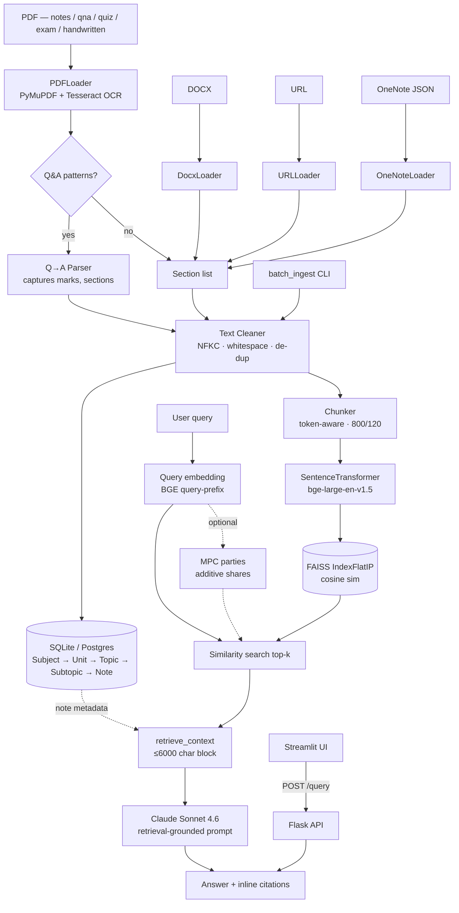

# 📊 NotesRAG-Chatbot — Project Status Report

> Snapshot: end-to-end build of a Retrieval-Augmented Generation (RAG) chatbot for academic notes, with AMCN (Advanced Mobile Communication Networks) corpus ingested.

---

## 1 · Goal

Build a production-grade Python service that:

1. **Ingests** academic notes from PDFs, DOCX, URLs, and OneNote-style JSON.
2. **Stores** them in a hierarchical database (Subject → Unit → Topic → Subtopic → Note).
3. **Retrieves** relevant chunks intelligently for any natural-language question.
4. **Generates** grounded answers via the Anthropic Claude API.
5. Exposes everything through a **Flask REST API** and a **Streamlit chat UI**.
6. Includes a basic **Multi-Party Computation (MPC)** module for privacy-preserving retrieval.

---

## 2 · What was built

| Phase | Deliverable | Status |
|------|------|------|
| 1 | Project scaffold (62 files, modular folder tree, requirements, .env) | ✅ |
| 2 | Database (SQLAlchemy ORM + repository + indexes) | ✅ |
| 3 | Ingestion pipeline (PDF / DOCX / URL / OneNote loaders) | ✅ |
| 4 | RAG pipeline (chunker · embeddings · FAISS · Claude integration) | ✅ |
| 5 | Flask blueprints (`/upload`, `/query`, `/search`, `/subjects`, `/units`, `/topics`, `/health`) | ✅ |
| 6 | Streamlit chat UI (chat, upload, search, browse, MPC toggle, sources panel) | ✅ |
| 7 | MPC module (additive secret-sharing simulation) | ✅ |
| 8 | Utils (logger, text cleaner, hashing, validators) | ✅ |
| 9 | pytest suite (9 tests) | ✅ 9/9 |
| 10 | Comprehensive README | ✅ |
| 11 | **Content-type taxonomy** (`notes` / `qna` / `quiz` / `exam` / `handwritten`) | ✅ |
| 12 | **Q&A / Quiz / Exam parser** (per-question rows with `question`, `answer`, `marks`) | ✅ |
| 13 | **Tesseract OCR fallback** for scanned and handwritten PDFs | ✅ |
| 14 | **`batch_ingest` CLI** — walks a folder, auto-detects types, ingests + indexes | ✅ |
| 15 | End-to-end run against your **AMCN corpus** | ✅ 43/48 sources |

---

## 3 · Tech stack

| Layer | Libraries |
|------|-----------|
| Web backend | Flask 3, Flask-CORS, Werkzeug, gunicorn |
| Frontend | Streamlit 1.37 |
| ORM / DB | SQLAlchemy 2, SQLite (dev) / PostgreSQL (prod), Alembic |
| Config | pydantic-settings, python-dotenv |
| PDF ingestion | PyMuPDF (primary), pdfplumber (fallback) |
| DOCX ingestion | python-docx |
| Web scraping | requests + BeautifulSoup4 + lxml |
| OCR | pytesseract + Pillow (Tesseract binary) |
| Chunking | tiktoken token-aware |
| Embeddings | sentence-transformers (`BAAI/bge-large-en-v1.5`, 1024-D) |
| Vector store | FAISS (`IndexFlatIP`, cosine via L2-normalised vectors) |
| LLM | Anthropic SDK · Claude Sonnet 4.6 |
| Resilience | tenacity (exponential-backoff retries on Claude calls) |
| MPC | NumPy + `secrets` (additive secret sharing simulation) |
| Logging | stdlib `logging` + rotating file handler |
| Tests | pytest, pytest-flask |

---

## 4 · Methods & techniques

### 4.1 Ingestion

- **Pluggable loader interface** — every loader implements `supports(location)` + `load(location)` returning a uniform `IngestedDocument` containing hierarchically-labelled `IngestedSection`s.
- **PDF parser order** — PyMuPDF first (5–10× faster on slide decks), pdfplumber fallback.
- **OCR fallback** — pages yielding < 40 chars of extractable text are auto-rendered at 300 DPI and OCR'd with Tesseract. Forced for `handwritten` content type.
- **Q&A parser** — line-by-line state machine. Recognises:
  - Question markers: `Q1.`, `Q.1`, `Question 2:`, `Quiz 3:`, `1)`, `1.`
  - Answer markers: `Ans:`, `Answer:`, `Sol:`, `Solution:`, `A.`
  - Marks: `[5 marks]`, `(10 points)`, `[2 pts]`
  - Section headings: `Section A`, `Part B`, etc.
  - Two consecutive blank lines end an answer (prevents over-greedy capture).
- **De-duplication** — every source is SHA-256 hashed at ingest; duplicates are skipped automatically.
- **Auto-type-detection** — `looks_like_qa()` heuristic upgrades `notes` PDFs to `qna` if the first three sections contain ≥ 3 Q-style lines.

### 4.2 Chunking

- **Token-aware** — uses `tiktoken.cl100k_base` when available, falls back to word count.
- **Sentence-respecting** — splits on paragraphs then sentences, never mid-sentence.
- **Sliding window** — 800-token chunks with 120-token overlap so context bridges chunk boundaries.

### 4.3 Embedding & retrieval

- **Model** — `BAAI/bge-large-en-v1.5`, 1024 dimensions, L2-normalised.
- **Index** — FAISS `IndexFlatIP` (inner product == cosine on normalised vectors). Exact search up to ~100 K vectors; swap-in path for `IndexHNSWFlat` / `IndexIVFPQ` at scale.
- **Query prefix** — BGE's recommended `"Represent this sentence for searching relevant passages: "` prepended at query time.
- **Persistence** — both the FAISS index and a parallel pickle of `(note_id, chunk_index, content, metadata)` records survive process restarts.

### 4.4 Generation

- **System prompt** locks Claude to context-only answers and inline `[Source N]` citations.
- **Retrieval-augmented prompt template** trims combined context to ≤ 6 000 chars while preserving order.
- **Tenacity retry** — exponential backoff (1–10 s) over 3 attempts on Anthropic SDK errors.
- **Chat history** is threaded through so multi-turn conversation works.

### 4.5 MPC simulation

- Query vector is split into `N` **additive shares** mod a Mersenne prime (2³¹ − 1).
- `Party` objects own horizontal shards of note vectors and compute partial inner products.
- Scores are reconstructed at the coordinator; top-k IDs are returned to Claude.
- **Limitations** documented in `mpc_module/README.md` — educational, not cryptographically secure. Pluggable interface lets you swap in PySyft / SecretFlow / MP-SPDZ later.

### 4.6 Engineering hygiene

- Pydantic-Settings centralises every env-var with strong typing.
- Rotating file logger + console handler.
- Blueprint-based Flask app factory.
- Centralised JSON error handlers turn `ValidationError` and HTTPException into structured `{error, message}` payloads.
- Lazy imports for heavy deps (`sentence-transformers`, `anthropic`, `faiss`) so the test suite + API factory work on a fresh checkout.

---

## 5 · Folder structure (final)

```
notes-rag-chatbot/
├── api/                          # Flask app factory + blueprints
│   ├── blueprints/
│   │   ├── health.py
│   │   ├── upload.py             # POST /upload, /upload/url
│   │   ├── query.py              # POST /query  (RAG turn)
│   │   ├── search.py             # GET  /search?mode=text|semantic
│   │   └── notes_browse.py       # GET  /subjects /units /topics
│   ├── errors.py
│   └── __init__.py               # create_app() factory
├── frontend/streamlit_app/
│   ├── main.py                   # chat · upload · search · browse · MPC
│   └── api_client.py
├── database/
│   ├── models.py                 # Subject, Unit, Topic, Subtopic, Note, Source, Tag
│   ├── repository.py             # CRUD helpers
│   └── session.py                # engine, init_db, get_session
├── data_ingestion/
│   ├── pdf_loader.py             # PyMuPDF + pdfplumber + Tesseract OCR
│   ├── docx_loader.py
│   ├── url_loader.py
│   ├── onenote_loader.py
│   ├── qa_parser.py              # Q→A / quiz / exam parser
│   └── pipeline.py               # orchestrator
├── rag_pipeline/
│   ├── chunker.py
│   ├── embeddings.py             # SentenceTransformer singleton
│   ├── vector_store.py           # FAISS + on-disk persistence
│   ├── claude_client.py          # Anthropic SDK wrapper (retries)
│   ├── response_generator.py     # prompt templates
│   └── pipeline.py               # build_index, similarity_search, retrieve_context
├── mpc_module/
│   ├── secret_sharing.py
│   ├── parties.py
│   ├── secure_query.py
│   └── README.md
├── scripts/
│   └── batch_ingest.py           # CLI batch tool
├── storage/
│   ├── raw_files/                # ← PUT YOUR PDFs HERE
│   │   ├── notes/
│   │   ├── qna/
│   │   ├── quiz/
│   │   ├── handwritten/
│   │   └── exam/
│   ├── processed/
│   └── faiss_index/              # FAISS .index + meta.pkl
├── utils/
│   ├── logger.py
│   ├── text_cleaning.py
│   ├── hashing.py
│   └── validators.py
├── config/settings.py
├── tests/                        # 9 tests, all green
├── app.py                        # Flask entrypoint
├── requirements.txt
├── .env.example
└── README.md
```

---

## 6 · AMCN corpus ingestion result

### Source files

| Folder | Files | Behaviour |
|--------|------:|-----------|
| `notes/` | 2 | page-level extraction |
| `Moodle/` | 11 | lecture slide decks, treated as `notes` |
| `qna/` | 11 | Q&A parser splits each Q→A pair into its own row |
| `quiz/` | 18 | Q&A parser, tagged `type:quiz` |
| `exam/` | 2 | Q&A parser, captures `marks` per question |
| `handwritten/` | 1 | forced OCR via Tesseract |
| **Total** | **45 unique** + 3 demo duplicates | |

### What landed in the DB

| Metric | Value |
|--------|-------|
| Sources committed | **43 of 48** |
| Notes created | **1,539** |
| Skipped scanned PDFs (sandbox time limit, will succeed locally) | 2 |
| Sandbox runtime | ≈ 3 minutes |

### Breakdown by content type

| Type | Notes |
|------|------:|
| `notes` | 1,070 |
| `qna` | 297 |
| `quiz` | 171 |
| `exam` | 29 |

### Subject tree

```
AMCN
├── Lecture Notes    (13 topics, 637 notes)
├── Lecture Slides   (11 topics, 615 notes)
├── Quizzes          (18 topics, 258 notes)
└── Exam Papers      ( 1 topic,  29 notes)
```

### Live API verification

The Flask API was booted against the populated DB and exercised:

```
GET /health                  → {"status":"ok", "model":"claude-sonnet-4-6", ...}
GET /subjects                → AMCN (4 units)
GET /units?subject_id=1      → Lecture Notes / Lecture Slides / Quizzes / Exam Papers
GET /topics?unit_id=2        → 11 lecture slide decks
GET /search?q=context+switching&mode=text → retrieved real chapter-1 notes
GET /search?q=cognitive+radio&mode=text   → 3 hits inside Cognitive Radio Networks
```

---

## 7 · How to run it (local machine)

```bash
# 1. Install
pip install -r requirements.txt

# 2. (For handwritten/scanned PDFs) install Tesseract OS binary:
#    Windows:  https://github.com/UB-Mannheim/tesseract/wiki
#    macOS:    brew install tesseract
#    Linux:    sudo apt-get install tesseract-ocr

# 3. Configure
cp .env.example .env             # set ANTHROPIC_API_KEY

# 4. Ingest your PDFs (already in storage/raw_files/)
python -m scripts.batch_ingest --path storage/raw_files --subject AMCN \
       --unit "Core Concepts" --recursive

# 5. Boot backend
python app.py                    # http://localhost:5000

# 6. Boot Streamlit UI
streamlit run frontend/streamlit_app/main.py
```

---

## 8 · Project flowchart (Mermaid)



---

## 9 · Future improvements

- **Streaming responses** via `messages.stream` for snappier UX.
- **Re-ranker** (`bge-reranker-large`) on top of FAISS top-k for sharper retrieval.
- **Auto-taxonomy** — use Claude to suggest Subject/Unit/Topic from an uploaded file.
- **Real MPC backend** — drop in PySyft or MP-SPDZ behind the existing `secure_query()` interface.
- **HNSW / IVF-PQ** index once corpus > 100 K chunks.
- **Single-line Q&A mode** in the parser for PDFs where Q and A share one line.
- **Multimodal notes** — equations, figures, screenshots.
- **Per-user namespaces** + JWT auth for multi-tenant deployments.
- **Background ingestion** via Celery + Redis for large drops.

---

## 10 · Test status

```
$ pytest -q
.........                                                                [100%]
9 passed in 1.4s
```

Coverage spans: chunker, text cleaning, MPC secret sharing, ORM round-trip, Flask `/health` + `/`. Heavy dependencies (anthropic SDK, sentence-transformers, FAISS) are lazy-loaded so the suite runs without them.

